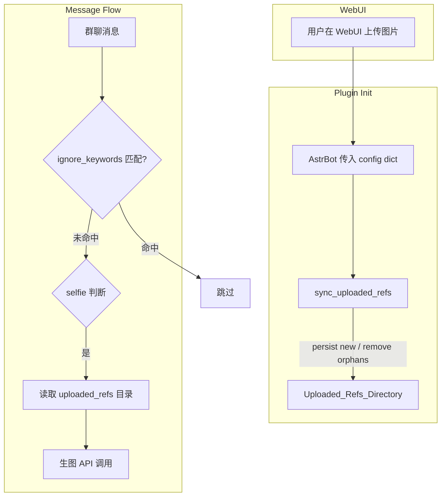

# Design Document: WebUI Image Upload

## Overview

本设计替换插件原有的 URL / 本地路径参考图配置方式，改用 AstrBot WebUI 原生的 `"type": "file"` 文件上传字段。上传的图片以 SHA-256 内容哈希命名持久化到 `{data_dir}/uploaded_refs/` 目录，插件初始化时与当前配置同步（增加新图、清理孤立文件）。生图流程直接从该目录读取字节，不再区分 URL 与 local_file 模式。

同时新增 `ignore_keywords` 排除关键词列表，在消息处理最早期进行子串匹配，命中时跳过整个自拍判断与生图流程。

## Architecture



### 关键设计决策

1. **SHA-256 命名** — 同一张图不管上传几次都只保存一份，初始化幂等。
2. **启动时全量同步** — 而非运行时按需解码，避免每次生图都做 base64 解码。
3. **移除 reference_input_mode** — 不再区分 URL / local_file，统一走本地字节。上传方式由 WebUI file 控件负责，插件只持久化后读取。
4. **ignore_keywords 在 LLM 调用之前** — 节省 token 并避免不必要的网络请求。

## Components and Interfaces

### 1. `_conf_schema.json` 变更

移除字段：
- `reference_input_mode`
- `reference_image_urls`
- `reference_image_files`
- `reference_image_dir`

新增字段：
```json
"reference_images": {
  "type": "file",
  "description": "参考人像（可多张）",
  "hint": "建议上传清晰正脸照，可多张做不同角度参考。",
  "file_types": ["jpg", "jpeg", "png", "webp"],
  "default": []
}
```

```json
"ignore_keywords": {
  "type": "list",
  "description": "排除关键词",
  "hint": "消息中包含任一关键词时，本插件完全不介入（不调用 LLM 判断、不触发生图）。用于避免和其他插件冲突。",
  "default": []
}
```

### 2. `core/uploaded_refs.py`（新文件）

纯逻辑模块，不含 AstrBot 依赖，便于单元测试。

```python
class UploadedRefsManager:
    """管理 uploaded_refs 目录的同步、持久化、读取。"""

    SUPPORTED_FORMATS: tuple[str, ...] = ("image/jpeg", "image/png", "image/webp")
    MAX_FILE_SIZE: int = 10 * 1024 * 1024  # 10 MB

    def __init__(self, refs_dir: Path):
        self.refs_dir = refs_dir
        self.refs_dir.mkdir(parents=True, exist_ok=True)

    def content_hash(self, data: bytes) -> str:
        """SHA-256 hex digest of file content."""

    def persist_image(self, data: bytes) -> Path | None:
        """Validate format & size, write to refs_dir/{hash}.{ext}. Returns path or None."""

    def sync(self, config_entries: list[dict]) -> SyncResult:
        """
        Full sync: persist new entries from config, remove orphans.
        Returns SyncResult with counts.
        """

    def list_reference_files(self) -> list[Path]:
        """List all valid image files in refs_dir sorted by name."""

    def load_reference_bytes(self) -> list[bytes]:
        """Read all reference image files as bytes."""
```

### 3. `main.py` 变更

- `_get_minimal_selfie_config()` 简化：移除 URL/file/dir 相关解析，新增 `ignore_keywords` 解析。
- 新增 `_sync_uploaded_references()` 方法，调用 `UploadedRefsManager.sync()`。
- `initialize()` 中调用 `_sync_uploaded_references()`，输出日志。
- `_load_minimal_selfie_reference_file_bytes()` 委托给 `UploadedRefsManager.load_reference_bytes()`。
- `_should_use_local_reference_files()` 始终返回 `True`（统一本地字节路径）。
- `_build_minimal_selfie_prompt()` 移除 URL 相关拼接。
- `minimal_selfie_group_message()` 在 `_judge_minimal_selfie_request` 之前新增 `ignore_keywords` 子串匹配检查。
- 初始化时检测遗留字段并 `logger.warning` 一次。

### 4. 消息处理中 ignore_keywords 的集成点

```python
# 在 minimal_selfie_group_message handler 中，位于消息文本提取之后、LLM 判断之前
ignore_kws = [kw.lower() for kw in conf.get("ignore_keywords", []) if kw.strip()]
if ignore_kws:
    msg_lower = message_text.lower()
    if any(kw in msg_lower for kw in ignore_kws):
        return  # 完全跳过，不 stop_event，让后续 handler 有机会处理
```

## Data Models

### AstrBot `"type": "file"` 配置值格式

AstrBot WebUI 将上传的文件作为 list of dict 写入 config：

```python
# config["minimal_selfie"]["reference_images"] 的运行时结构
[
    {
        "name": "selfie_ref_1.jpg",   # 原始文件名
        "data": "<base64 encoded bytes>",
        "type": "image/jpeg"          # MIME type（可能缺失）
    },
    ...
]
```

### 磁盘持久化格式

```
{data_dir}/uploaded_refs/
├── a1b2c3d4...（64 hex chars）.jpg
├── e5f6g7h8...（64 hex chars）.png
└── ...
```

文件名 = `{sha256_hex}.{ext}`，ext 由 magic bytes 检测得出（不信任 config 中的 name/type）。

### `SyncResult` 数据类

```python
@dataclass
class SyncResult:
    persisted: int      # 新写入磁盘的文件数
    skipped: int        # 已存在跳过的文件数
    orphans_removed: int  # 清理的孤立文件数
    errors: int         # 格式/大小校验失败数
    total_files: int    # 同步后目录中的文件总数
    total_bytes: int    # 同步后目录中的文件总字节
```


## Correctness Properties

*A property is a characteristic or behavior that should hold true across all valid executions of a system—essentially, a formal statement about what the system should do. Properties serve as the bridge between human-readable specifications and machine-verifiable correctness guarantees.*

### Property 1: Content-addressed naming

*For any* valid image bytes (PNG, JPEG, or WebP, ≤ 10 MB), persisting the image SHALL produce a file whose name is `{sha256_hex_of_bytes}.{ext}` where `ext` is determined by the magic bytes of the content (jpg, png, or webp).

**Validates: Requirements 3.3, 3.4, 7.1**

### Property 2: Invalid format rejection

*For any* byte payload that does not begin with recognized PNG, JPEG, or WebP magic bytes, `persist_image` SHALL return `None` and NOT write any file to the refs directory.

**Validates: Requirements 3.5, 7.1, 7.2**

### Property 3: Oversized image rejection

*For any* byte payload larger than 10 MB (even if it has valid image magic bytes), `persist_image` SHALL return `None` and NOT write any file to the refs directory.

**Validates: Requirements 7.3**

### Property 4: Sync correctness

*For any* combination of initial disk state (set of files in uploaded_refs) and config entries (list of base64-encoded image dicts), after `sync()` completes:
- Every valid config entry's content exists on disk (named by its content hash)
- No file exists on disk whose content hash is absent from the set of valid config entries
- Invalid/oversized config entries do not produce files

**Validates: Requirements 3.1, 5.1, 5.2, 5.3**

### Property 5: Sync idempotence

*For any* config entries list, calling `sync(config_entries)` twice in sequence SHALL produce `persisted == 0` on the second call, and the directory contents SHALL be identical after both calls.

**Validates: Requirements 5.4**

### Property 6: Load returns all persisted files

*For any* set of N valid images persisted to the refs directory, `load_reference_bytes()` SHALL return exactly N byte arrays, and the set of returned byte contents SHALL equal the set of originally persisted byte contents.

**Validates: Requirements 4.1**

### Property 7: Keyword exclusion

*For any* non-empty ignore_keywords list and any message string that contains at least one keyword (case-insensitive substring match), the plugin's message handler SHALL skip processing without invoking LLM judgment.

**Validates: Requirements 6.3**

## Error Handling

| Scenario | Behavior |
|----------|----------|
| Config entry with invalid base64 | Skip entry, log warning, continue sync |
| Config entry with valid base64 but non-image content | Skip entry, log warning, continue sync |
| Config entry > 10 MB decoded | Skip entry, log warning, continue sync |
| `uploaded_refs` directory cannot be created (permissions) | Raise RuntimeError at init, plugin fails to load |
| All config entries invalid (0 valid images persisted) | Warn at init; raise RuntimeError when selfie generation is triggered |
| Legacy fields present in config | Ignore them, log deprecation warning once |
| Disk read failure when loading reference bytes | Raise RuntimeError with file path info |

## Testing Strategy

### Property-Based Tests (using `hypothesis`)

每个 Correctness Property 对应一个 hypothesis property test，最少 100 次迭代。

- **Test file:** `tests/test_uploaded_refs_properties.py`
- **Library:** `hypothesis` (Python)
- **Configuration:** `@settings(max_examples=100)`

测试需要的 generators：
- `valid_image_bytes(format)` — 生成带正确 magic bytes 的最小有效图片（PNG 8-byte header + IHDR, JPEG FFD8FF + minimal, WebP RIFF header）
- `random_bytes()` — 生成不匹配任何已知 magic bytes 的随机字节
- `config_entry(image_bytes)` — 将 bytes 编码为 `{"name": ..., "data": base64, "type": ...}` 格式

Tag format: `Feature: webui-image-upload, Property {N}: {title}`

### Unit Tests (example-based)

- **Test file:** `tests/test_uploaded_refs.py`
- 验证 schema 字段正确性（Requirements 1.1, 2.1, 2.2, 6.1, 6.2）
- 验证 legacy field 忽略 + 日志（Requirement 1.3）
- 验证目录自动创建（Requirement 3.2）
- 验证初始化日志输出 count/size（Requirements 4.3, 7.4）
- 验证无参考图时生图报错（Requirement 4.4）
- 验证 keyword matching 不调用 LLM（Requirement 6.4）
- 验证 ignore_keywords 为空时不做检查（Requirement 6.5）

### Integration Verification

- 手动验证 WebUI 渲染 file upload 控件（Requirement 2.3）
- 端到端：上传图片 → 重启 → 触发生图 → 确认参考图被使用
